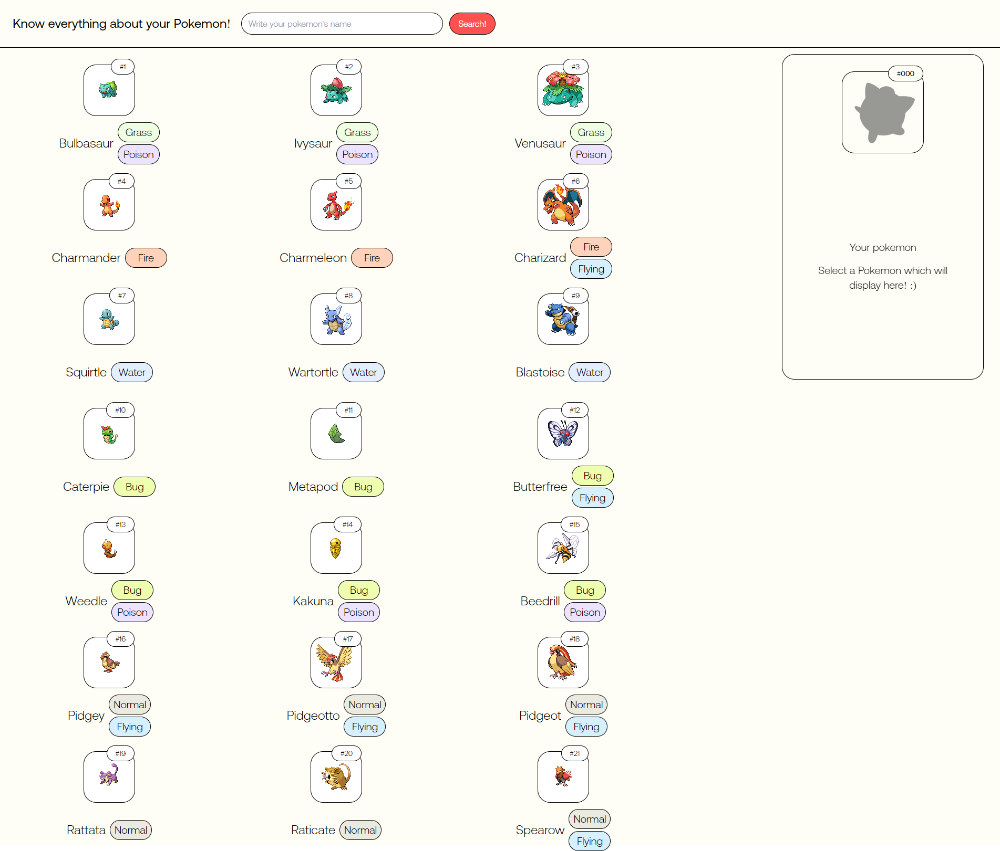

# PokéDex

A simple Pokémon catalogue, built with [React](https://reactjs.org/), [TailwindCSS](https://tailwindcss.com/) and [PokéAPI](https://pokeapi.co/).

## Screenshot



## Built With

- React
- TailwindCSS
- PokéAPI

## Getting started

```sh
git clone https://github.com/BOGomDAH/Pokedex.git
cd Pokedex
npm install
npm start 
```

## Features
- View basic details of each Pokémon
- Search Pokémon by its Name/ID
- Responsive design

## License

Released in 2022.
This project is under the [MIT license](https://github.com/BOGomDAH).

Made by [BOGomDAH](https://github.com/BOGomDAH)